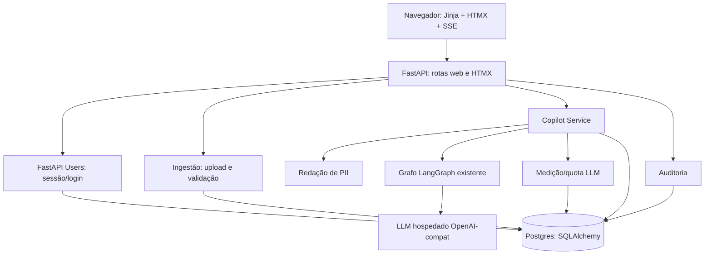

# F1 — MVP do gestlog (copiloto read-only) — Design

**Spec**: `.specs/features/f1-mvp/spec.md`
**Status**: Draft (awaiting approval)

---

## Architecture Overview

Aplicação web única (FastAPI) que serve páginas SSR (Jinja2 + HTMX) e endpoints
HTMX/SSE. A camada de copiloto reaproveita o grafo LangGraph existente,
envelopado por um serviço que injeta contexto do tenant, redige PII, mede uso e
persiste a conversa. Postgres guarda tenants, usuários, dados importados,
conversas, recomendações, auditoria e uso.



---

## Code Reuse Analysis

### Existing Components to Leverage

| Component | Location | How to Use |
| --- | --- | --- |
| Grafo supervisor + especialistas | `src/gestlog/graph.py` | Chamar `build_graph`/`run_query` a partir do Copilot Service |
| Especialistas e prompts | `src/gestlog/agents/` | Reusar sem alterar; o domínio já existe |
| Tools read-only | `src/gestlog/tools/` | Reusar; trocar o backend mock pelo dado importado do tenant |
| Config | `src/gestlog/config.py` | Estender `Settings` (DB, auth, retenção, quotas) |
| Fábrica de modelo | `src/gestlog/llm.py` | Reusar `build_chat_model` |
| Estado do grafo | `src/gestlog/state.py` | Reusar `AgentState` |
| Testes com modelo fake | `tests/conftest.py` | Reusar `fake_model_cls`; nenhum teste toca rede |
| Convenções | `AGENTS.md` | Manter estilo, black/ruff, docstrings em pt-BR |

### Integration Points

| System | Integration Method |
| --- | --- |
| LLM | Endpoint OpenAI-compatível via `ChatOpenAI` (já existente) |
| Banco | Postgres via SQLAlchemy 2.x + Alembic (novo) |
| Autenticação | FastAPI Users (novo), sessão por cookie |
| Dados do cliente | Importação CSV/planilha no MVP (F3 substitui por API) |

---

## Components

### Web app (FastAPI)

- **Purpose**: servir páginas SSR e endpoints HTMX/SSE, autenticados.
- **Location**: `src/gestlog/web/`
- **Interfaces**: rotas `/login`, `/conta`, `/importar`, `/chat`, `/chat/stream` (SSE), `/recomendacoes`.
- **Dependencies**: FastAPI, Jinja2, HTMX, FastAPI Users, SQLAlchemy.
- **Reuses**: nada existente de web (novo).

### Auth & Tenancy

- **Purpose**: login, sessão, papéis e resolução do `tenant_id` por requisição.
- **Location**: `src/gestlog/auth/`
- **Interfaces**: `get_current_user()`, `get_current_tenant()`, dependências FastAPI; guardas de acesso.
- **Dependencies**: FastAPI Users, SQLAlchemy.
- **Reuses**: `Settings`.

### Ingestão

- **Purpose**: receber CSV/planilha, validar/normalizar e persistir por tenant.
- **Location**: `src/gestlog/ingestion/`
- **Interfaces**: `import_dataset(tenant_id, tipo, file) -> ImportResult`; validadores por tipo.
- **Dependencies**: pandas/openpyxl (avaliar dependências), SQLAlchemy.
- **Reuses**: padrões do repositório.

### Copilot Service

- **Purpose**: receber pergunta, injetar dados do tenant nas tools, rodar o grafo,
  redigir PII, medir uso e persistir conversa/recomendação.
- **Location**: `src/gestlog/copilot/`
- **Interfaces**: `answer(tenant_id, user_id, question) -> stream[str]`.
- **Dependencies**: grafo existente, repositórios, `PII`, `Meter`.
- **Reuses**: `graph.build_graph`, `llm.build_chat_model`, `state.AgentState`.

### Data access do tenant (tools)

- **Purpose**: fazer as tools lerem os dados importados do tenant em vez do mock.
- **Location**: `src/gestlog/tools/` (adaptar) + `src/gestlog/repositories/`
- **Interfaces**: as mesmas assinaturas das tools atuais, agora com `tenant_id` no
  contexto.
- **Dependencies**: SQLAlchemy.
- **Reuses**: assinaturas/prompts atuais; **trocar o corpo**, não a estrutura
  (como o próprio `AGENTS.md` recomenda).

### PII Redaction

- **Purpose**: remover/minimizar PII antes de enviar texto ao LLM.
- **Location**: `src/gestlog/privacy/`
- **Interfaces**: `redact(text) -> RedactedText`; política por tenant.
- **Dependencies**: regex/allowlist (sem LLM).
- **Reuses**: —.

### Metering & Quota

- **Purpose**: medir tokens/uso por tenant e aplicar quota.
- **Location**: `src/gestlog/copilot/metering.py`
- **Interfaces**: `record_usage(tenant_id, tokens, model)`, `check_quota(tenant_id)`.
- **Dependencies**: SQLAlchemy, `Settings`.

### Avaliação (golden set)

- **Purpose**: executar golden set por domínio e reportar acurácia.
- **Location**: `evals/` (script) + `src/gestlog/evaluation/` (núcleo testável).
- **Interfaces**: `run_golden_set(dataset) -> EvalReport`.
- **Dependencies**: grafo, modelo.
- **Reuses**: `tests/conftest.py` fake model para testes.

### Persistência

- **Purpose**: modelos e migrations.
- **Location**: `src/gestlog/db/` + `alembic/`
- **Interfaces**: `Base`, sessão, repositórios.
- **Dependencies**: SQLAlchemy, Alembic, psycopg.

---

## Data Models

```python
class Tenant:            # id, nome, criado_em, retencao_dias
class User:              # id, email, hash, ativo (FastAPI Users)
class Membership:        # user_id, tenant_id, papel (admin|operador|gestor)
class ImportJob:         # id, tenant_id, tipo, status, aceitas, rejeitadas, criado_em
class ImportError:       # id, import_job_id, linha, motivo
class StockItem:         # tenant_id, sku, nome, quantidade, minimo, local
class Supplier:          # tenant_id, fornecedor_id, nome, categoria, prazo_dias, avaliacao, ativo
class TransportRecord:   # tenant_id, origem, destino, peso_kg (dados de frete/rastreio)
class Conversation:      # id, tenant_id, user_id, criado_em
class Message:           # id, conversation_id, papel, conteudo_redigido, criado_em
class Recommendation:    # id, conversation_id, dominio, texto, justificativa, fontes(json)
class Feedback:          # id, recommendation_id, decisao(aceita|descartada), user_id, criado_em
class UsageRecord:       # id, tenant_id, modelo, tokens, criado_em
class AuditLog:          # id, tenant_id, user_id, evento, detalhe, criado_em
```

**Relationships**: tudo pendurado em `Tenant` via `tenant_id`; `Membership` liga
`User`↔`Tenant`; conversas → mensagens → recomendações → feedback.

---

## Error Handling Strategy

| Error Scenario | Handling | User Impact |
| --- | --- | --- |
| Sem sessão / sessão expirada | Redireciona para login | Página de login |
| Acesso a recurso de outro tenant | 404 (não vaza existência) | "Não encontrado" |
| Arquivo de import inválido | Validação na entrada, erros por linha | Tela de status com motivos |
| LLM timeout/falha | Mensagem de degradação + auditoria | "Não consegui responder agora" |
| Quota de LLM excedida | Bloqueio com aviso | Aviso de limite do plano |
| Dado insuficiente para recomendar | Resposta de insuficiência | Orientação do que importar |

---

## Tech Decisions

| Decision | Choice | Rationale |
| --- | --- | --- |
| Framework backend | FastAPI | Async, tipagem, casa com o core Python/LangGraph |
| UI | Jinja2 + HTMX + SSE | Menos peças para dev solo; streaming sem SPA |
| Tenancy | Postgres único + `tenant_id` | Simples, padrão de mercado; guardas na app + RLS opcional |
| Banco | PostgreSQL | JSONB para import, concorrência e escala SaaS |
| Auth | FastAPI Users (self-hosted) | Registro/login/convites em Python, sem vendor |
| Reuso do copiloto | Envelopar o grafo atual | Reaproveita 99% de cobertura e o desenho supervisor+especialistas |
| Persistência de dados da tools | Repositórios por tenant | Substitui o mock sem mudar prompts/assinaturas |

---

## Open Questions

1. Política de upsert na importação (SKU/fornecedor duplicados): substituir ou erro?
2. Formato exato do golden set (JSON/YAML? campos de fonte esperada?).
3. RLS no Postgres além das guardas na aplicação — ou apenas app-level no MVP?
4. Streaming: token a token do LLM ou a resposta final por SSE? (afeta p95 percebida)
