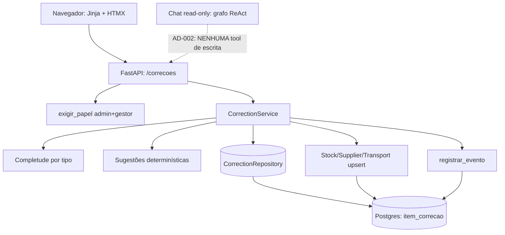

# F2 — HITL: escrita com aprovação — Design

**Spec**: `docs/specs/features/f2-hitl/spec.md`
**Status**: Awaiting human approval

---

## Architecture Overview

A F2 adiciona um **caminho de escrita com aprovação humana** ao lado do copiloto.
O grafo LangGraph continua **read-only** (AD-002): a escrita não é uma tool, é um
serviço de domínio (`correcoes/`) orquestrado pela camada web, atrás de um guard de
papel e de uma fila persistida (`item_correcao`). O item é materializado a partir
dos cadastros incompletos do tenant, com sugestão determinística; a decisão humana
e a aplicação usam o `upsert` existente e gravam auditoria na mesma transação.



---

## Code Reuse Analysis

### Existing Components to Leverage

| Component | Location | How to Use |
| --- | --- | --- |
| `EmpresaScopedRepository` | `repositories/base.py` | Base do `CorrectionRepository`; `get/list` já filtram por empresa |
| `upsert` de estoque/fornecedor/transporte | `repositories/catalog.py` | Aplicar a correção reusando o mesmo caminho da importação |
| `AuditRepository` / `registrar_evento` | `repositories/telemetry.py`, `audit/eventos.py` | Trilha por empresa; evento validado no catálogo |
| Retenção por empresa | `audit/retencao.py`, `repositories/conversations.py` | Estender `purgar_expiradas` para a nova tabela |
| Dependências de auth/tenancy | `auth/deps.py` (`exigir_papel`, `get_current_empresa`, `get_current_user`) | Guarda `admin`+`gestor`, `empresa_id` da sessão |
| Sessão sync por requisição | `web/ingestion_ui.py` (`get_sync_session`) | Mesmo padrão das rotas de escrita |
| Padrão PRG 303 + `Form()` default `""` | `web/admin_ui.py`, `web/feedback.py` | Rotas HTML de mutação (L-009) |
| Schemas `Literal` | `web/schemas.py` | `DecisaoCorrecao` |
| Templates/nav | `web/templates/base.html` | Entrada de navegação condicionada a papel |
| Testes com modelo fake / DB em memória | `tests/conftest.py` | Nenhum teste toca rede |

### Integration Points

| System | Integration Method |
| --- | --- |
| Banco | SQLAlchemy 2.x + Alembic (nova revision) |
| Catálogos do tenant | `StockRepository`/`SupplierRepository`/`TransportRepository.upsert` |
| Auditoria | `audit.eventos.registrar_evento` (sem commit; caller é a UoW) |

---

## Components

### Domínio de correções (`src/gestlog/correcoes/`)

- **Purpose**: regras de completude, geração determinística de sugestões e o
  serviço de fila/decisão/aplicação.
- **Location**: `src/gestlog/correcoes/` (novo top-level, como `ingestion/` e
  `copilot/`).
- **Interfaces**:
  - `completude.campos_faltantes(tipo, registro) -> list[str]`
  - `completude.valor_atual(tipo, registro, campo) -> str`
  - `sugestoes.sugerir(tipo, campo, registro, contexto) -> Sugestao`
  - `servico.CorrectionService` (ver abaixo)
- **Dependencies**: `libs` (`db.models`, `repositories`, `audit`). **Não** depende
  de `agents/` (grafo) — mantém a fronteira `apps → agents → libs` e a separação do
  read-only.
- **Reuses**: `upsert` dos catálogos, `registrar_evento`.

### Repositório de correções (`src/gestlog/repositories/correcoes.py`)

- **Purpose**: CRUD escopado por empresa da fila, incluindo busca para dedup e para
  a trilha.
- **Location**: `libs` (`src/gestlog/repositories/`), única porta de SQL.
- **Interfaces**:
  - `get(empresa_id, item_id) -> ItemCorrecao | None` (via base)
  - `list_by_status(empresa_id, status) -> list[ItemCorrecao]`
  - `existe_para(empresa_id, tipo, alvo_chave, campo, valor_no_pedido) -> bool`
  - `abertos_para(empresa_id, tipo, alvo_chave, campo) -> list[ItemCorrecao]`
  - `listar_trilha(empresa_id, desde, ate, limite) -> list[ItemCorrecao]`
  - `purgar_expiradas(empresa_id, limite) -> int`

### Serviço de correções (`CorrectionService`)

- **Purpose**: materializar itens pendentes, decidir (aprovar/rejeitar) e aplicar a
  correção com auditoria.
- **Location**: `src/gestlog/correcoes/servico.py` (`@dataclass(frozen=True)` com
  `session`, `empresa_id`; espelha `CopilotService`).
- **Interfaces**:
  - `gerar_fila() -> list[ItemCorrecao]` (idempotente)
  - `listar(status="pendente") -> list[ItemCorrecao]`
  - `aprovar(item_id, user_id, papel) -> ItemCorrecao`
  - `rejeitar(item_id, user_id, papel, justificativa) -> ItemCorrecao`
  - `trilha(desde, ate, limite) -> list[ItemCorrecao]`
- **Dependencies**: `CorrectionRepository`, catálogos, `registrar_evento`.
- **Reuses**: `upsert` por tipo.

### Web (`src/gestlog/web/correcoes.py`)

- **Purpose**: fila, decisão e trilha (HTML PRG), guard `admin`+`gestor`.
- **Location**: `apps`.
- **Interfaces**: `create_correcoes_router()`.

---

## Data Models

### `ItemCorrecao` (tabela `item_correcao`)

```python
class ItemCorrecao(Base):
    __tablename__ = "item_correcao"
    __table_args__ = (
        Index("ix_item_correcao_empresa_status", "empresa_id", "status"),
        Index("ix_item_correcao_alvo", "empresa_id", "tipo", "alvo_chave", "campo"),
    )

    id: UUID                      # PK
    empresa_id: UUID              # FK empresa.id
    tipo: str                     # "estoque" | "fornecedores" | "transporte"
    alvo_chave: str(40)           # chave natural do registro (SKU/fornecedor_id/código), uppercase
    campo: str(40)                # nome da coluna faltante
    valor_no_pedido: str(255)     # snapshot do valor (ausente) na geração; base do conflito
    valor_sugerido: str(255)|None # None => "sem sugestão"
    justificativa: str(2000)      # por que o valor foi sugerido
    fonte: str(255)               # dado/derivação que sustenta a sugestão
    status: str(20)               # pendente|aprovado|rejeitado|aplicado|falhou
    motivo_rejeicao: str(2000)|None
    decidido_por: UUID|None       # FK user.id (aprovador)
    papel_aprovador: str(20)|None # papel no momento da decisão (admin|gestor)
    decidido_em: datetime|None    # timezone=True
    aplicado_em: datetime|None    # timezone=True
    motivo_falha: str(255)|None
    created_at: datetime          # geração
```

**Classificação de domínio** (ver `docs/specs/project/STATE.md`): `tenant` =
`Empresa`; código em português (AD-008).

### Máquina de estados (terminal e imutável)

```
                  aprovar                 aplicar ok
   pendente ───────────────► aprovado ───────────────► aplicado   (terminal)
      │                         │
      │                         └── erro/conflito/alvo ─► falhou   (terminal)
      └── rejeitar ──► rejeitado                                (terminal)
```

- Estados terminais: `rejeitado`, `aplicado`, `falhou`. Um item nesses estados
  **nunca** é re-decidido: nova decisão → **409** (APR-05, EDG-04).
- `aprovado` é a decisão registrada; no F2 a aplicação é **síncrona na mesma
  requisição**, então o estado observável final é `aplicado`/`falhou` (o
  intermediário existe para um apply desacoplado futuro).
- **Uma nova correção do mesmo campo é um item novo** (decisão humana 5); o
  `ItemCorrecao` aberto nunca é reaberto.

### Regra de dedup/materialização (idempotente)

`gerar_fila()` cria um item para cada par `(tipo, alvo_chave, campo)` atualmente
faltante que ainda não tem item, com as regras:

1. Se existe item **aberto** (`pendente`/`aprovado`) para a chave → não cria.
2. Se existe item **terminal** para a chave com o **mesmo `valor_no_pedido`** →
   não cria (a decisão anterior permanece "sticky" até o valor mudar).
3. Caso contrário (chave nova, ou valor atual mudou em relação ao último snapshot)
   → cria novo `pendente`.

Assim, reabrir a fila não duplica pendentes e uma rejeição não é recriada a cada
carregamento; uma reimportação que muda o valor libera um item novo. Casos-limite:
EDG-01 (um item por campo), EDG-02 (conflito de reimportação).

---

## Regras de completude (vazio/zero/default = ausente)

Campos verificados são **explícitos por tipo** (não "qualquer zero"), para não
marcar valores legítimos como ausentes (ex.: `quantidade=0`, `ativo=False`).

| Tipo | Campo | Ausente quando | Observação |
| --- | --- | --- | --- |
| estoque | `nome` | `not nome.strip()` | |
| estoque | `minimo` | `minimo <= 0` | |
| estoque | `local` | `not local.strip()` | |
| fornecedores | `nome` | `not nome.strip()` | |
| fornecedores | `categoria` | `not categoria.strip()` | |
| fornecedores | `prazo_dias` | `prazo_dias <= 0` | |
| fornecedores | `avaliacao` | `avaliacao <= 0.0` | |
| transporte | `origem` | `not origem.strip()` | |
| transporte | `destino` | `not destino.strip()` | |
| transporte | `peso_kg` | `peso_kg <= 0.0` | |
| transporte | `status` | `not status.strip()` | |

**Não verificados** (identidade ou booleanos): `sku`, `fornecedor_id`,
`codigo_rastreio`, `quantidade`, `ativo`. `quantidade` é contagem (0 é válido);
`ativo` é booleano (default `True` é válido). *(Decisão de design para revisão.)*

`valor_no_pedido` serializa o valor atual em string canônica: `str()` para texto,
`str(int)`/`str(float)` para números, `str(bool)` para bool. `valor_atual` devolve a
mesma serialização para comparação de conflito.

---

## Geração de sugestões (determinística, sem LLM)

Baseada apenas nos **dados do próprio tenant** (registros irmãos do mesmo tipo).
Sem base → `valor_sugerido=None` ("sem sugestão"); **nunca** inventar (SUG-03).

| Tipo | Campo | Estratégia de sugestão | Fonte (rótulo) |
| --- | --- | --- | --- |
| fornecedores | `categoria` | categoria não vazia mais frequente entre os demais fornecedores | `"categoria mais comum entre N fornecedores"` |
| fornecedores | `prazo_dias` | mediana dos `prazo_dias > 0` dos demais | `"prazo mediano dos fornecedores"` |
| fornecedores | `avaliacao` | média (1 casa) das `avaliacao > 0` dos demais | `"avaliação média dos fornecedores"` |
| fornecedores | `nome` | — (sem base) | — |
| estoque | `minimo` | mediana dos `minimo > 0` dos demais itens | `"estoque mínimo mediano dos itens"` |
| estoque | `local` | `local` não vazio mais frequente entre os demais | `"local mais comum nos itens"` |
| estoque | `nome` | — (sem base) | — |
| transporte | `origem` | `origem` não vazio mais frequente entre os demais registros | `"origem mais frequente nos registros"` |
| transporte | `destino` | `destino` não vazio mais frequente entre os demais | `"destino mais frequente nos registros"` |
| transporte | `status` | `status` não vazio mais frequente entre os demais | `"status mais frequente nos registros"` |
| transporte | `peso_kg` | — (sem base: peso é específico do registro) | — |

**Determinismo:** empate de frequência resolvido por ordem lexicográfica; mediana de
lista par pela média dos dois centrais (arredondada). A `Sugestao` é um dataclass
frozen `(campo, valor, justificativa, fonte)`; `valor=None` significa sem sugestão
(SUG-01..03, SUG-05). O item guarda `valor_no_pedido` (atual) separado de
`valor_sugerido` e `fonte` (SUG-05, SUG-04).

**Item sem sugestão:** permanece na fila (marcado "sem sugestão") para decisão
consciente, mas **não pode ser aprovado** (nada a aplicar) → **409**; pode ser
rejeitado. *(Decisão de design para revisão.)*

---

## Aprovação, aplicação e auditoria

`CorrectionService.aprovar(item_id, user_id, papel)`:

1. `CorrectionRepository.get(empresa_id, item_id)`; `None` → **404** (APR-06,
   ESC-05, sem vazar existência).
2. `status != "pendente"` → **409** (APR-05, EDG-04).
3. `valor_sugerido is None` → **409** (sem sugestão).
4. Resolve o registro alvo pelo `alvo_chave` **no `empresa_id` da sessão**; ausente
   → marca `falhou` (`motivo_falha="registro alvo inexistente"`) e **409** sem
   escrita (EDG-03).
5. **Conflito:** compara o valor atual com `valor_no_pedido`; divergente → marca
   `falhou` (`motivo_falha="registro alterado após a sugestão"`) e **409** sem
   sobrescrever (EDG-02).
6. **Sem opção de no-op:** se `valor_sugerido == valor_atual` → marca `aplicado`
   sem chamar `upsert` (sem escrita efetiva) e segue a auditoria (EDG-05).
7. Aplica: carrega o registro, sobrepõe **apenas** o `campo`, chama o `upsert`
   correspondente do tenant; idempotente pelo mesmo caminho da importação (ESC-01).
8. Na **mesma transação**: `status="aprovado"` → `decidido_por/decidido_em/
   papel_aprovador`, `status="aplicado"`, `aplicado_em`, `registrar_evento(...)`,
   commit (ESC-02). O item sai da fila (ESC-03).

`CorrectionService.rejeitar(item_id, user_id, papel, justificativa)`:

1. Passos 1–2 iguais (404/409).
2. `justificativa` vazia após `strip()` → **422** (APR-03).
3. `status="rejeitado"`, `motivo_rejeicao`, `decidido_por/decidido_em/
   papel_aprovador`, `registrar_evento(EVENTO_CORRECAO_REJEITADA)`, commit.

**Falha de escrita:** exceção na aplicação → `session.rollback()` e, numa transação
nova, marca `falhou` + `registrar_evento(EVENTO_CORRECAO_FALHOU)`; o valor anterior
permanece intacto (ESC-04). *(`upsert` faz `flush` mas o commit é da UoW; o
rollback desfaz a escrita.)*

**Concorrência:** a atualização de status parte do item re-lido; uma segunda decisão
encontra estado terminal e cai no passo 2 (409). Para o caso de corrida real, a
transição pode usar `UPDATE ... WHERE status='pendente'` e checar rowcount;
alternativa de uniqueness não é necessária em F2 (EDG-04). *(Decisão de design.)*

### Eventos de auditoria

Novos em `src/gestlog/audit/eventos.py` (adicionados a `EVENTOS`):

| Constante | Valor | Call site | `detalhe` |
| --- | --- | --- | --- |
| `EVENTO_CORRECAO_APROVADA` | `correcao_aprovada` | `aprovar` (após validar) | `{item_id, tipo, alvo_chave, campo}` |
| `EVENTO_CORRECAO_REJEITADA` | `correcao_rejeitada` | `rejeitar` | `{item_id, tipo, alvo_chave, campo}` |
| `EVENTO_CORRECAO_APLICADA` | `correcao_aplicada` | `aprovar` (após upsert) | `{item_id, tipo, alvo_chave, campo, valor}` |
| `EVENTO_CORRECAO_FALHOU` | `correcao_falhou` | `aprovar` (conflito/alvo/erro) | `{item_id, motivo}` |

`detalhe` **nunca** carrega `justificativa`/`motivo_rejeicao` (texto livre do
usuário) nem PII; o `valor` é dado operacional de catálogo, truncado. O valor
aplicado completo fica no item (`valor_sugerido`), referenciável por `item_id`
(ESC-02, ESC-06). Os eventos vivem no **caminho de aplicação**, não no turno de
chat — o conjunto exato de eventos do chat permanece inalterado (AD-022).

---

## Superfície web

`create_correcoes_router()` (registrado em `web/app.py`):

| Rota | Método | Guarda | Comportamento |
| --- | --- | --- | --- |
| `/correcoes` | GET | `exigir_papel("admin","gestor")` | `gerar_fila()` idempotente e lista `pendente`s agrupados por tipo (INC-01..04) |
| `/correcoes/{item_id}/decisao` | POST | `exigir_papel("admin","gestor")` | `form`: `decisao: DecisaoCorrecao`, `justificativa: str = ""`; PRG 303 (APR-02/03/04) |
| `/correcoes/historico` | GET | `exigir_papel("admin","gestor")` | trilha por período, `desde`/`ate` (TRA-01..03) |

- `DecisaoCorrecao = Literal["aprovar", "rejeitar"]` em `web/schemas.py` (fonte
  única de opções, L-013).
- Erros re-renderizam a página com mensagem: 404 (cross-tenant), 403 (papel), 409
  (terminal/sem sugestão/conflito), 422 (rejeição sem justificativa).
- Sem sessão → a dependência de auth redireciona ao login / 401 (INC-05, EDG-09);
  nenhuma escrita ocorre antes da autenticação.
- Paginação/limite na listagem para volume alto (EDG-08) e estado vazio (EDG-06/07).
- Nav em `base.html`: entrada "Correções" exibida quando o papel é `admin`/`gestor`
  (flag `pode_aprovar` no contexto, além de `admin`).
- O chat continua read-only; nada de itens acionáveis no chat (AD-002).

---

## Retenção

`CorrectionRepository.purgar_expiradas(empresa_id, limite)` apaga itens **decididos**
(status terminal) com `created_at < limite` (itens pendentes são operacionais e
permanecem). `audit/retencao.py::purgar_expiradas` passa a chamar também esse
método por empresa, somando ao total retornado, na mesma transação (EDG-10, decisão
humana 6). O `AuditLog` continua não purgado (AD-022).

---

## Como o AD-002 (read-only) é preservado

1. **Nenhuma tool de escrita** é adicionada a `build_inventory_tools` /
   `build_supplier_tools` / `build_transport_tools`. O conjunto vinculado ao grafo
   permanece exatamente o read-only da F1.
2. A escrita vive em `correcoes/servico.py`, chamada apenas por rota web autenticada
   — **fora** do loop ReAct, que executa qualquer tool vinculada genericamente
   (`agents/base.py:95-104`).
3. O `CorrectionService` **não** depende de `agents/`/grafo; não há caminho do LLM
   até o `upsert`.
4. Testes de contrato afirmam o conjunto read-only das tools e a ausência de mutação
   no caminho do chat (reforça `test_cop_02_usa_ferramentas_read_only`).

---

## Error Handling Strategy

| Error Scenario | Handling | User Impact |
| --- | --- | --- |
| Sem sessão / sessão expirada | Redireciona ao login | Página de login (sem escrita) |
| Item de outro tenant / alvo de outro tenant | 404 (não vaza existência) | "Não encontrado" |
| Papel não autorizado (`operador`) | 403 sem alterar o item | "Permissão insuficiente" |
| Item já decidido | 409 (terminal) | Aviso de item encerrado |
| Item sem sugestão aprovado | 409 | Aviso "sem sugestão" |
| Alvo alterado/sumido antes da aprovação | Marca `falhou`, 409, sem escrita | Aviso de conflito |
| Rejeição sem justificativa | 422 | Formulário reexibido |
| Erro na escrita | Rollback, `falhou`, valor anterior intacto | Aviso de falha |
| Fila vazia / sem dados | Estado vazio / orientação a importar | Orientação clara |

---

## Tech Decisions

| Decision | Choice | Rationale |
| --- | --- | --- |
| Onde mora a escrita | Serviço `correcoes/` fora do grafo | Preserva AD-002 sem tocar o ReAct |
| Persistência da fila | Tabela `item_correcao` | Estado terminal, autoria e trilha por item |
| Incompleto | Regras explícitas por tipo sobre colunas atuais | Sem migration de nulabilidade; evita falso "zero ausente" |
| Sugestão | Determinística, dados do tenant, sem LLM | Testável, barata, nunca inventa |
| Aplicação | Reuso do `upsert` existente, 1 transação com auditoria | Mesmo caminho da importação; sem escrita parcial |
| Aprovadores | `exigir_papel("admin","gestor")` | Decisão humana 1 |
| Retenção | Purga itens decididos + mantém `AuditLog` | AD-022 e decisão humana 6 |

---

## Decisões de design para revisão (Checkpoint 2)

1. **Dedup/materialização:** "sticky" por `valor_no_pedido` — um item terminal não é
   recriado enquanto o valor do campo não mudar; reabrir a fila não duplica.
2. **Item "sem sugestão":** entra na fila mas só pode ser **rejeitado** (aprovar sem
   valor → 409).
3. **Campos não verificados:** `quantidade`/`ativo`/identidades ficam de fora da
   completude (0 e `True` são válidos).
4. **Apply síncrono:** aprovação e aplicação na mesma requisição (sem worker em F2);
   `aprovado` existe como estado válido para um apply desacoplado futuro.
5. **Trilha (P2):** servida da própria `item_correcao` (registro/campo/valor/autor/
   timestamp), com o `AuditLog` como trilha de conformidade canônica; possível
   divergência se a purga remover o item antes do `AuditLog` (AuditLog não é
   purgado).
6. **`detalhe` de auditoria:** carrega metadados + `valor` aplicado (dado
   operacional), mas não o texto livre de justificativa/motivo.
7. **Concorrência:** transição via checagem de estado lido; hardening com
   `UPDATE ... WHERE status='pendente'` + rowcount se necessário.
